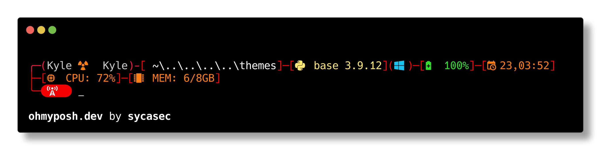

# Oh-my-posh custom theme
## download oh my posh
- `winget install oh-my-posh`
- `choco install oh-my-posh`

## use this theme
- check out the Themes section in Oh My posh website to learn how to use themes. 
- download this theme and add it to your themes section, then plug it in!

Have fun!
